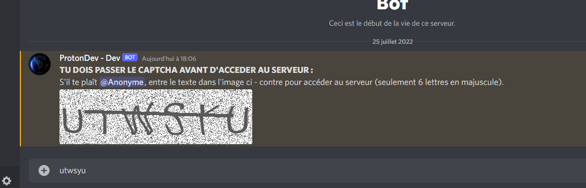
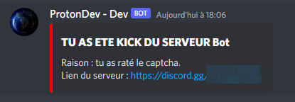
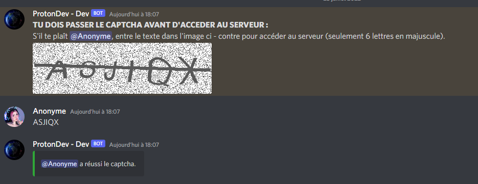
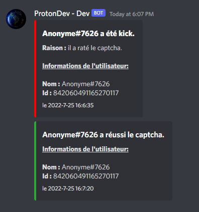

<h1 align="center">

OldModz95

</h1>
<p align="center">
  <a href="https://discord.gg/MS6TMgRfqB"></a>
</p>
<p align="center">
  <a href="https://discord.gg/M3sTyHtcK4"></a>
</p>

<br>

### Bot Discord Raid Protect in Python By OldModz95 Proposed By ProtonDev
<br><br>

## REJOIGNIEZ LE SERVEUR DISCORD - JOIN SERVER DISCORD!!!!!!!!!!!!!!!!!!!!!!!!

https://discord.gg/MS6TMgRfqB
<br><br>
## Installation
<br>
Ouvrez un terminal depuis la racine du dossier du bot et faite:
```
- pip install -r requirements.txt
```

Aller dans le fichier `config.example.json` pour ajouter les informations demander.<br>
Changer le nom du fichier par `config.json`<br>
Sur le panel développeur de Discord activer les options `server members intent`<br>

<br>

# Information
<br>

```
Captcha firewall
Minimum account age required
Anti nudity image
Anti profanity
Anti spam
Logs
Basic moderation commands
Multi guild support
Multi language (EN, FR)
```
<br>
Restrictions do not affect members with ADMINISTRATOR permission !

<br>
<br>
<br>

## Video Tutoriel

<a href="https://youtu.be/MSNdSEBOPpw">

</a>


<br>
<br>

<br>

## IMAGE

<br>



<br>


<br>


<br>


<br>

<br><br>


## 📞 Contact me

[Discord](https://www.discord.gg/MS6TMgRfqB)
[Twitter](https://twitter.com/oldmodz95)
<br>
[YouTube (Server Private)](https://exotique.fr2.quickconnect.to/?launchApp=SYNO.SDS.VideoStation.AppInstance#!libOldModz95/N4IgNglgRgTghjAniAXCAFgewLYFMD6AbhACa6YC0A7CADQgDGcALrgOaZKohxhh0gADnDa5UARgC+QA)
<p>Username: ytb <br>
Password: oldmodz95</p>

<br />

## 🔧 Technologies & Tools


###### Version control system


###### License


###### Operating systems


## &#x1f4c8; GitHub Stats

<a href="https://github.com/OldModz95-YTB">
  
</>
<a href="https://github.com/OldModz95-YTB">
  
</a>

<p align="left">  </p>
